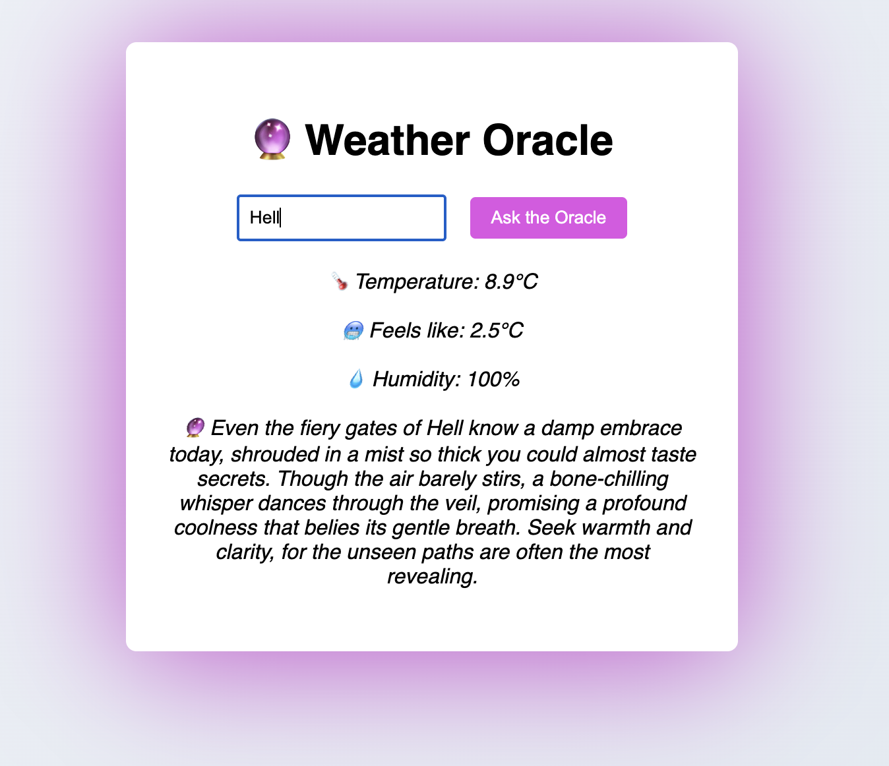

# Whimsical Weather (Weather Oracle MVP)

Whimsical Weather is a full-stack TypeScript app that transforms weather data into mystical, story-like forecasts.
Users enter a city, and the app returns:

- Temperature
- Feels-like temperature
- Humidity
- A whimsical oracle response generated by Gemini

## Why This Project

Weather reports are usually factual and plain. This project explores a more engaging UX by combining real weather data with LLM-generated narrative output.

Instead of:

`It is 20°C and partly cloudy.`

You get:

`The clouds drift like slow omens, and the day carries a warm promise.`

## Screenshot of MVP Weather Oracle



## MVP Scope

- City text input on frontend
- Server-side weather/API key handling (no weather key on client)
- City -> coordinates -> Meteoblue weather retrieval
- Prompt construction from normalized weather fields
- Gemini 2.5 oracle generation
- Frontend rendering of weather metrics + oracle response

## Architecture

### Request Flow

`Frontend city input`
-> `GET /v1/oracle?city=...`
-> `Meteoblue location search (city -> lat/lon)`
-> `Meteoblue weather (current_basic-1h)`
-> `Normalize weather data`
-> `Build oracle prompt`
-> `Gemini 2.5 generateContent`
-> `Return JSON to frontend`

### Tech Stack

- Frontend: React + Vite + TypeScript
- Backend: Express + TypeScript
- Weather provider: Meteoblue
- LLM provider: Google Gemini API
- Testing: Vitest + Supertest

## Getting Started

### 1. Install dependencies

```bash
npm install
```

### 2. Configure environment

Create `.env` in project root:

```env
PORT=3000
METEOBLUE_API_KEY=your_meteoblue_key
GEMINI_API_KEY=your_gemini_key
```

### 3. Run in development

```bash
npm run dev
```

- Frontend: `http://localhost:5173`
- Backend: `http://localhost:3000`

## API

### `GET /v1/oracle?city=<cityName>`

Returns:

```json
{
  "city": "Wellington",
  "lat": -41.2866,
  "lon": 174.776,
  "oracle": "Mystical response text...",
  "oraclePrompt": "Prompt sent to Gemini...",
  "weather": {
    "temperature": 21.1,
    "feelsLike": 20.4,
    "humidity": 68,
    "windSpeed": 8.7,
    "cloudiness": null,
    "precipitation": null,
    "pictocode": 3,
    "isDaylight": true
  }
}
```

## Testing

```bash
npm test -- --run
```

Notes:

- Route tests mock Meteoblue and Gemini calls (no live third-party dependency).

## Error Handling

- Missing city -> `400`
- City not found -> `404`
- Missing API keys -> `500`
- Meteoblue upstream failure -> `502`
- Gemini failure -> falls back to a safe oracle message so weather data still returns

## Scripts

- `npm run dev` - start frontend + backend in watch mode
- `npm run build` - build client and server
- `npm start` - run production server build
- `npm test -- --run` - run tests once

## Project Status

MVP is functional and aligned to backend-first scope:

- Meteoblue-backed weather retrieval
- Gemini-powered oracle output
- Frontend display of core weather metrics + mystical report
